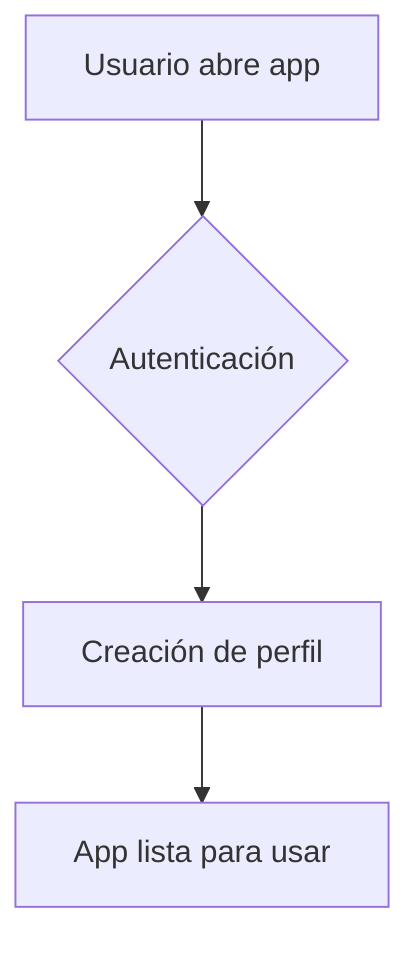
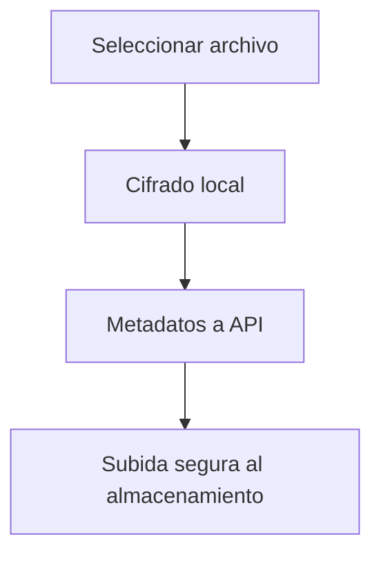
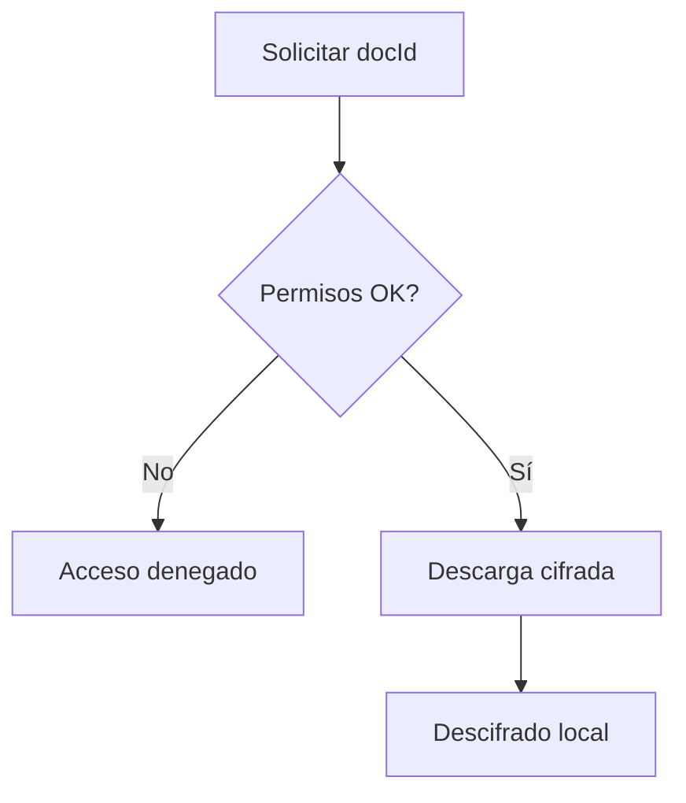
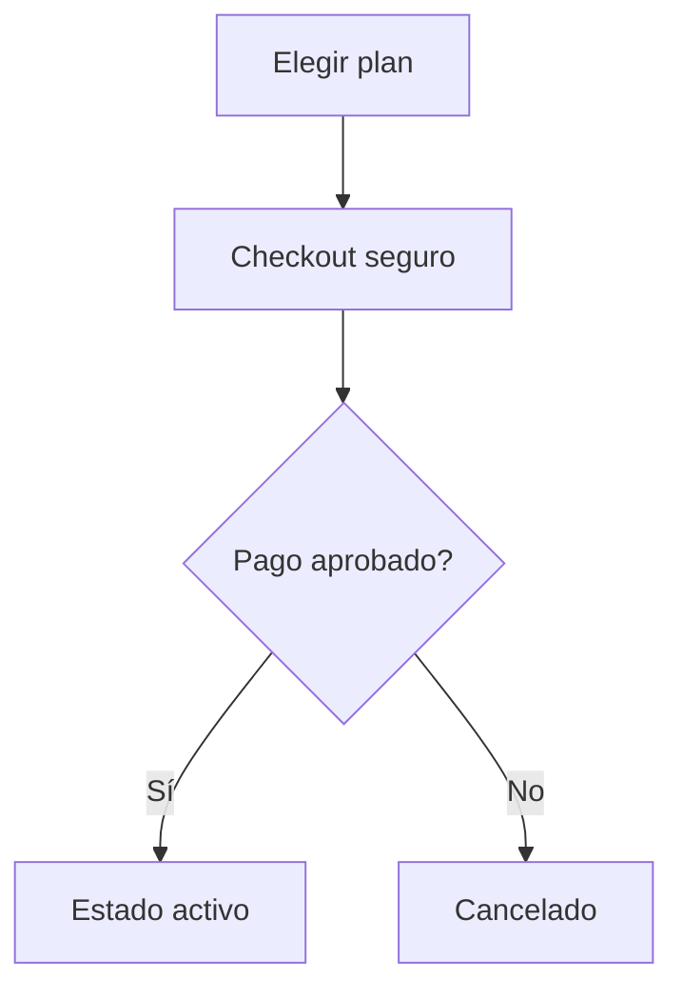

# Roadmaps (Resumen público)

## Alta de usuario

```mermaid
flowchart TD
  A[Usuario abre app] --> B{Autenticación}
  B --> C[Creación de perfil]
  C --> D[App lista para usar]
```

## Subida de documento privado

```mermaid
flowchart TD
  A[Seleccionar archivo] --> B[Cifrado local]
  B --> C[Metadatos a API]
  C --> D[Subida segura al almacenamiento]
```

## Visualización de documento

```mermaid
flowchart TD
  A[Solicitar docId] --> B{Permisos OK?}
  B -- No --> C[Acceso denegado]
  B -- Sí --> D[Descarga cifrada] --> E[Descifrado local]
```

## Suscripción

```mermaid
flowchart TD
  A[Elegir plan] --> B[Checkout seguro]
  B --> C{Pago aprobado?}
  C -- Sí --> D[Estado activo]
  C -- No --> E[Cancelado]
```
